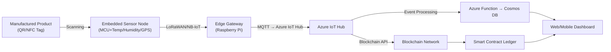
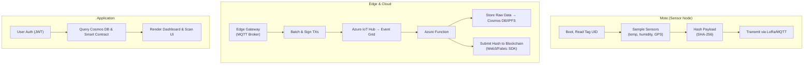
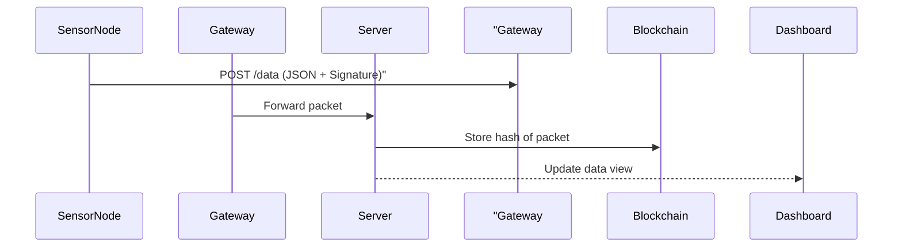
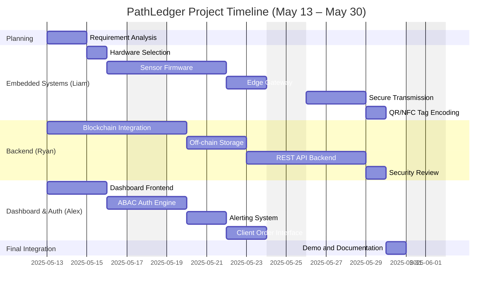

<h1 align="center">
  
</h1>

# Juno - Orange PathLedger 
## Product Lifecycle Via Blockchain Passport

# Team Members
- Alexander Strang ()
- Liam Mulhern (47428748)
- Ryan Smith ()

---

# Project and Scenario Description
An end-to-end IoT + blockchain solution that creates a tamper-proof “Digital Product Passport” (DPP) for physical goods. Each manufactured product carries a unique QR code that encodes a link to the user dashboard with JWT for authentication and hash to it's block chain model. Embedded sensor nodes (e.g. thingy52) record environmental data (temperature, humidity, location, custody transfers, impact) throughout the supply chain, hashing and anchoring snapshots on the IOTA blockchain. Clients placing a product order specify the requirements that the products must be subject to while in distribution. They are then alerted if the product exceeds these specifications. Sensor nodes also offer an NFC interface that can be scanned and link to the user dashboard identifying alterts. Stakeholders—from suppliers to consumers—scan the QR code to instantly verify provenance, integrity, and handling history, improving trust, compliance, and recall responsiveness.

---

## Deliverables & Key Performance Indicators

| Deliverable                                                                            | KPI / Success Metric                                                  |
|----------------------------------------------------------------------------------------|-----------------------------------------------------------------------|
| **1. IoT Sensor Prototype** MCU firmware for environmental sensing and tagging.     | ≥ 99 % packet delivery rate over LoRaWAN/NB-IoT in tests.             |
| **2. Blockchain Smart Contract** Permissioned chain contract to store event hashes. | Record ≥ 1 000 on-chain events without error.                         |
| **3. Off-chain Data Store Integration** Raw sensor logs in Azure Cosmos DB or IPFS. | Average write latency < 200 ms; ≥ 99.9 % data durability.             |
| **4. Web/Mobile Dashboard** DPP lookup, analytics, alerting UI.                     | Page load ≤ 300 ms; user task success rate ≥ 95 % in usability tests. |
| **5. ABAC Permission Engine** Attribute-based access control for all stakeholders.  | 100 % enforcement of role policies in penetration tests.              |
| **6. End-to-End Traceability Demo** Consumer-facing app scan → full history.        | Time to display full provenance ≤ 5 s; zero incorrect records.        |

---

## System Overview

### Hardware Architecture

### Software Implementation Flow

- Mote: Lightweight firmware reads tag, senses environment, hashes data, transmits.
- Edge & Cloud: Gateway aggregates, Azure IoT Hub ingests, Azure Functions store raw logs in Azure CosmosDB and push hashes on-chain. Data is also stored off-chain for fatster look ups and is verified using on-chain hash.
- Application: Stakeholders login or use JWT-protected QR codes to sign into dashboard which fetches combined on-chain/off-chain data for visualization, showing alerts. Clients submit product orders through dashboard and identify the requirements that the product must be shipped in.

<h1 align="center">
  
</h1>

# Juno - Orange PathLedger

## Product Lifecycle Via Blockchain Passport

# Team Members

* Alexander Strang ()
* Liam Mulhern (47428748)
* Ryan Smith ()

---

## Project and Scenario Description

An end-to-end IoT + blockchain solution that creates a tamper-proof “Digital Product Passport” (DPP) for physical goods. Each manufactured product carries a unique QR code that encodes a link to the user dashboard with JWT for authentication and hash to its blockchain model. Embedded sensor nodes (e.g. thingy52) record environmental data (temperature, humidity, location, custody transfers, impact) throughout the supply chain, hashing and anchoring snapshots on the IOTA blockchain. Clients placing a product order specify the requirements that the products must be subject to while in distribution. They are then alerted if the product exceeds these specifications. Sensor nodes also offer an NFC interface that can be scanned and link to the user dashboard identifying alerts. Stakeholders—from suppliers to consumers—scan the QR code to instantly verify provenance, integrity, and handling history, improving trust, compliance, and recall responsiveness.

---

## Deliverables & Key Performance Indicators

| Deliverable                                                                            | KPI / Success Metric                                                  |
| -------------------------------------------------------------------------------------- | --------------------------------------------------------------------- |
| **1. IoT Sensor Prototype** MCU firmware for environmental sensing and tagging.     | ≥ 99 % packet delivery rate over LoRaWAN/NB-IoT in tests.             |
| **2. Blockchain Smart Contract** Permissioned chain contract to store event hashes. | Record ≥ 1 000 on-chain events without error.                         |
| **3. Off-chain Data Store Integration** Raw sensor logs in Azure Cosmos DB or IPFS. | Average write latency < 200 ms; ≥ 99.9 % data durability.             |
| **4. Web/Mobile Dashboard** DPP lookup, analytics, alerting UI.                     | Page load ≤ 300 ms; user task success rate ≥ 95 % in usability tests. |
| **5. ABAC Permission Engine** Attribute-based access control for all stakeholders.  | 100 % enforcement of role policies in penetration tests.              |
| **6. End-to-End Traceability Demo** Consumer-facing app scan → full history.        | Time to display full provenance ≤ 5 s; zero incorrect records.        |

---

## System Overview

### Hardware Architecture

### Software Implementation Flow

* Mote: Lightweight firmware reads tag, senses environment, hashes data, transmits.
* Edge & Cloud: Gateway aggregates, Azure IoT Hub ingests, Azure Functions store raw logs in Azure CosmosDB and push hashes on-chain. Data is also stored off-chain for faster lookups and is verified using on-chain hash.
* Application: Stakeholders login or use JWT-protected QR codes to sign into dashboard which fetches combined on-chain/off-chain data for visualization, showing alerts. Clients submit product orders through dashboard and identify the requirements that the product must be shipped in.

---

## Sensor Integration

> TODO: Change this as it is auto generated

| Sensor Type | Data Collected        | Integration Method      |
| ----------- | --------------------- | ----------------------- |
| SHT31       | Temperature, Humidity | I2C, polled every 5s    |
| MPU6050     | Shock, Angle, Motion  | I2C, triggered on event |
| NEO-6M      | Geolocation (GPS)     | UART, polled every 10s  |

* Data packets are encoded in compact JSON and signed with a pre-shared cryptographic key.
* I2C buses use Zephyr RTOS drivers for sensor interfacing.

---

## Wireless Communication and Message Protocol

### Network Topology

* Star topology with central Edge Gateway node
* MQTT or HTTPS REST uplink to server

### Message Protocol Diagram

### Data Rate

* Average message size: 200 bytes
* Frequency: 1 message/10 seconds
* Uplink bandwidth: \~20 bytes/sec/node

---

## Algorithm Schemes (Blockchain)

* **Blockchain Layer**: Hyperledger Fabric / IOTA MAM
* **Hashing**: SHA-256 hash of payloads
* **Verification**: Packet signatures checked using ECDSA
* **Storage**: Off-chain data in IPFS, on-chain metadata on Hyperledger

---

## DIKW Pyramid Application

### Scenario

A refrigerated medical shipment must maintain <8°C. A temperature spike is detected during a layover in transit.

| Layer       | Contribution                                                            |
| ----------- | ----------------------------------------------------------------------- |
| Data        | Sensor readings (7.2°C) and GPS tag                                     |
| Information | Linked timestamped spike with location (Brisbane Airport)               |
| Knowledge   | Interpreted as cold chain failure window                                |
| Wisdom      | Future routing avoids this layover; audit trail used in liability claim |

---

## Project Software/Hardware Management

### Task Allocation (by Role)

| ID  | Task                   | Description                                                       | Assigned To | Difficulty |
| --- | ---------------------- | ----------------------------------------------------------------- | ----------- | ---------- |
| T1  | Requirement Analysis   | Define objectives, constraints, stakeholders                      | All         | Medium     |
| T2  | Hardware Selection     | Select Thingy52, sensors, and comm modules                        | Liam        | Medium     |
| T3  | Sensor Firmware        | Zephyr RTOS firmware: sensor polling, JSON encoding, cryptography | Liam        | High       |
| T4  | Edge Gateway           | MQTT gateway and buffer relay                                     | Liam        | Medium     |
| T5  | Secure Transmission    | MQTT over TLS, ECDSA signing                                      | Liam        | High       |
| T6  | Blockchain Integration | Smart contract deployment, hash storage using IOTA/Fabric         | Ryan        | Very High  |
| T7  | Off-chain Storage      | Azure CosmosDB/IPFS for raw data, indexing                        | Ryan        | High       |
| T8  | REST API Backend       | Flask or Django backend to serve dashboard and ingest sensor data | Ryan        | High       |
| T9  | Dashboard Frontend     | React or Vue UI with traceability view, product search            | Alex        | Medium     |
| T10 | ABAC Auth Engine       | Implement JWT and role-based access to dashboard/API              | Alex        | Medium     |
| T11 | Alerting System        | Evaluate telemetry against order specs + notification logic       | Alex        | Medium     |
| T12 | QR/NFC Tag Encoding    | Generate product QR codes, NFC tag handling                       | Liam        | Medium     |
| T13 | Client Order Interface | UI for clients to submit order constraints                        | Alex        | Medium     |
| T14 | Integration Testing    | Validate end-to-end telemetry flow                                | All         | High       |
| T15 | Security Review        | Simulate tampering and penetration testing                        | Ryan        | High       |
| T16 | Demo and Documentation | Create setup guide, diagrams, final system walkthrough            | All         | Medium     |

### Gantt Chart

