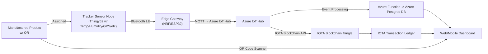
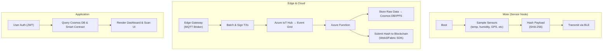
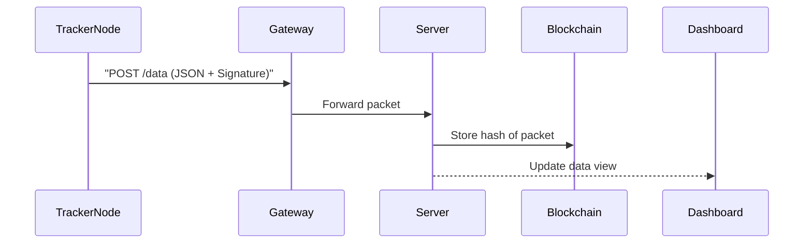
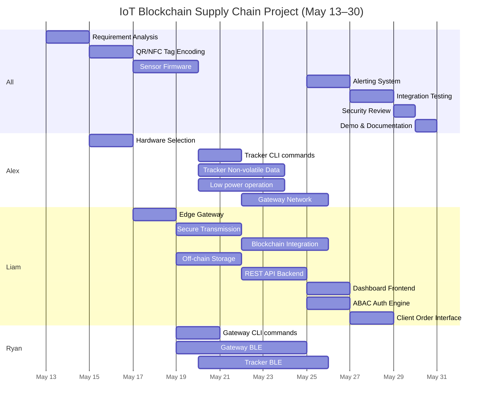

<h1 align="center">
  
</h1>

# Juno - Orange PathLedger

## Product Lifecycle Via Blockchain Passport

# Team Members

* Alexander Strang (47423510)
* Liam Mulhern (47428748)
* Ryan Smith (47444131)

---

## Project and Scenario Description

An end-to-end IoT and blockchain solution that creates a tamper-proof “Digital Product Passport” (DPP) for physical goods. Each manufactured product carries a unique QR code that links to an encoded user dashboard with a JSON Web Token (JWT) for authentication and hash to its blockchain model. Embedded sensor nodes attached to the mobile device (e.g. thingy52) record environmental data (temperature, humidity, location, pressure, custody transfers, Evoc Gas levels) throughout the supply chain, anchoring the hashed data to the IOTA blockchain. Clients placing a product order, specify the requirements that the products must be subject to while in distribution, and the levels are then monitored by the tracker. They are then alerted if the product exceeds these specifications. Mobile nodes also offer a Near Field Communication (NFC) interface that can be scanned and linked to the user dashboard, highlighting alerts. Allowing stakeholders to scan the QR code to instantly verify provenance, integrity and handling history, improving trust, compliance, and recall responsiveness.

---

## Deliverables & Key Performance Indicators

| Deliverable                                                                            | KPI / Success Metric                                                  |
| -------------------------------------------------------------------------------------- | --------------------------------------------------------------------- |
| **1. IoT Sensor Prototype** MCU firmware for environmental sensing and tagging.     | 100% packet delivery rate over bluetooth in tests.*                   |
| **2. Blockchain Smart Contract** Permissioned chain contract to store event hashes. | Record all on-chain events without error.                             |
| **3. Off-chain Data Store Integration** Raw sensor logs in Azure Postgres SQL DB    | Average write latency < 200 ms; ≥ 99.9 % data durability.             |
| **4. Web/Mobile Dashboard** DPP lookup, analytics, alerting UI.                     | Displays relevant data for users based on relevant permission         |
| **5. Sensor Readings**<brGather all sensors, on interrupts and rtc                     | 100% success rate at collecting sensors and triggers on all motion.   |
| **6. End-to-End Traceability Demo** Consumers can view a package's full history.    | Time to display full provenance ≤ 5 s; zero incorrect records.        |
| **7. Cloud-to-device two-way communication** Communication between cloud and device | Full transmission of all messages between cloud and device.           |

---

## System Overview

### Hardware Architecture

### Software Implementation Flow

* Mote: Lightweight firmware reads tag, senses environment, hashes data, transmits.
* Edge & Cloud: Gateway aggregates, Azure IoT Hub ingests, Azure Functions store raw logs in Azure CosmosDB and push hashes on-chain. Data is also stored off-chain for faster lookups and is verified using on-chain hash.
* Application: Stakeholders login or use JWT-protected QR codes to sign into dashboard which fetches combined on-chain/off-chain data for visualization, showing alerts. Clients submit product orders through dashboard and identify the requirements that the product must be shipped in.

---

## Sensor Integration

| Sensor Type | Data Collected        | Integration Method      |
| ----------- | --------------------- | ----------------------- |
| ST_LPS22HB  | Temperature, Pressure | I2C, when polled        |
| ST_HTS221   | Humidity              | I2C, when polled        |
| NEOM9N      | Geolocation (GPS)     | I2C, When polled        |
| ACS_CCS811  | Air Quality           | I2C, When polled        |
| LIS2DH12    | Accelerometer         | I2c, When polled        |
* Data packets are encoded in compact JSON and signed with a pre-shared cryptographic key.
* I2C buses use Zephyr RTOS drivers for sensor interfacing.

---

## Wireless Communication and Message Protocol

### Network Topology

* Star topology with central Edge Gateway node
* MQTT uplink to server

### Message Protocol Diagram

---

## Algorithm Schemes (Blockchain)

* **Blockchain Layer**: IOTA MAM
* **Hashing**: SHA-256 hash of payloads
* **Verification**: Packet signatures checked using ECDSA
* **Storage**: Off-chain data in Azure Postgres DB, on-chain metadata in IOTA Tangle

---

## DIKW Pyramid Application

### Scenario

A refrigerated medical shipment must maintain <8°C. A temperature spike is detected during a layover in transit.

| Layer       | Contribution                                                            |
| ----------- | ----------------------------------------------------------------------- |
| Data        | Sensor readings (7.2°C) and GPS tag                                     |
| Information | Linked timestamped spike with location (Brisbane Airport)               |
| Knowledge   | Interpreted as cold chain failure window                                |
| Wisdom      | Future routing avoids this layover; audit trail used in liability claim |

---

## Project Software/Hardware Management

### Task Allocation (by Role)

| ID   | Task                     | Description                                                                 | Assigned To | Difficulty  |
|------|--------------------------|-----------------------------------------------------------------------------|-------------|-------------|
| T1   | Requirement Analysis     | Define objectives, constraints, stakeholders                                | All         | Medium      |
| T2   | Hardware Selection       | Select Thingy52, sensors, and comm modules                                  | Alex        | Medium      |
| T3   | Sensor Firmware          | Zephyr RTOS firmware: sensor polling, JSON encoding, cryptography           | All         | High        |
| T4   | Edge Gateway             | MQTT gateway and buffer relay on Azure                                      | Liam        | Medium      |
| T5   | Secure Transmission      | MQTT over TLS, ECDSA signing                                                | Liam        | High        |
| T6   | Blockchain Integration   | Smart contract deployment, hash storage using IOTA                          | Liam        | Very High   |
| T7   | Off-chain Storage        | Azure Postgres DB for raw data, indexing                                    | Liam        | High        |
| T8   | REST API Backend         | Flask or Django backend to serve dashboard and ingest sensor data           | Liam        | High        |
| T9   | Dashboard Frontend       | React or Vue UI with traceability view, product search                      | Liam        | Medium      |
| T10  | ABAC Auth Engine         | Implement JWT and role-based access to dashboard/API                        | Liam        | Medium      |
| T11  | Alerting System          | Evaluate telemetry against order specs + notification logic                 | All         | Medium      |
| T12  | QR/NFC Tag Encoding      | Generate product QR codes, NFC tag handling                                 | All         | Medium      |
| T13  | Client Order Interface   | UI for clients to submit order constraints                                  | Liam        | Medium      |
| T14  | Integration Testing      | Validate end-to-end telemetry flow                                          | All         | High        |
| T15  | Security Review          | Simulate tampering and penetration testing                                  | All         | High        |
| T16  | Demo and Documentation   | Create setup guide, diagrams, final system walkthrough                      | All         | Medium      |
| T17  | Tracker CLI Commands     | Add CLI to tracker node for manufacturer settings                           | Alex        | Medium      |
| T18  | Gateway CLI Commands     | Add CLI to gateway base for manufacturer settings                           | Ryan        | Medium      |
| T19  | Tracker Non-volatile Data| Implement non-volatile data storage to mobile tracker for persistent memory | Alex        | Hard        |
| T20  | Gateway BLE              | Bluetooth low energy GATT interface on gateway                              | Ryan        | Very Hard   |
| T21  | Tracker BLE              | Bluetooth low energy GATT interface on tracker                              | Ryan        | Very Hard   |
| T22  | Gateway Network          | Transmit tracker data from gateway to IoT Hub                               | Alex        | Hard        |
| T23  | Low Power Operation      | Apply power management for tracker                                          | Alex        | Hard        |

### Gantt Chart

---

## Member Contributions

### Alexander Strang - 47423510 (Member 1)
Set up the tracker node's functionality. Connected all sensors, adapted drivers, set sensor triggers, set up thingy52's flash. Adapted gnss driver for thingy52. Set up the thingy52's flash storage_partition as a 20kB ring buffer, implementing rudementary garbage collection. Set up the drivers and a trigger for the lis2dh12, functionality for the lps22hb, hts221 and ccs811 sensors. Set up and developed a driver for the 2nd counter/timer and led on the thingy52. Adapated power management of thingy52. Established onboard led to act as actuator. 

### Liam Mulhern - 474428748 (Member 2)
Set up the neonm9n gnss driver for the nucleo board. Set up the M5 Core as a notification dashboard, capable of displaying the alerts and data passed from the server via WiFi over HTTP. Designed all aspects of the server, including the website, MQTT hosts and UART gateway (server side). Integrated a block chain into the gateway - server connection, to ensure security. Developed hash encoding and decoding on the server and tracker side, so the data could not be tampered with. Setup the display dashboards, and website, such that packages can be tracked and all data is readily avaliable to the users. 

### Ryan Smith - 47444131 (Member 3)
Developed the bluetooth libraries for both the tracker and gateway nodes. Implementing package concatination, automatic connections and disconnections, cryptographically secure packages, many-to-many subscriber-publisher connections. Implemented Bluetooth connection as a GATT interface with central bases subscribing to connected peripheral tracker nodes, with centrals able to gatt write to update device ID's of tracker over bluetooth. Implemented JSON parsing of the package (central side). Adapted thingy52 bluetooth DID advertising such that it allows the thingy52 to enter low power mode if a connection is not made. 
