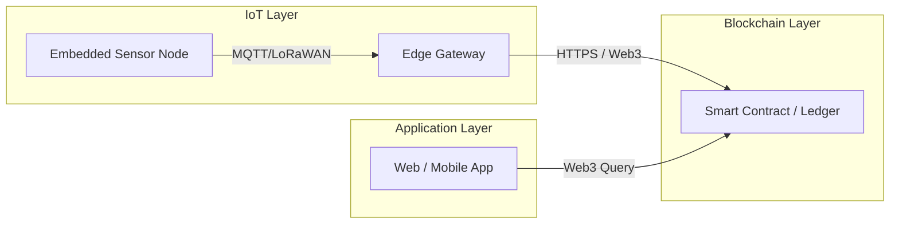

# Digital Product Passport for Supply-Chain Monitoring

A proof-of-concept embedded-IoT + blockchain solution that creates a tamper-proof “Digital Product Passport” (DPP).
Each product carries a unique NFC/QR tag; IoT sensor nodes record events (manufacture, transport, storage, sale) and anchor hashed data on a blockchain.
End users (retailers, regulators, consumers) scan the tag to verify provenance, authenticity, and handling history.

---

## Table of Contents

1. [Project Vision](#project-vision)
2. [User Scenario & Stakeholders](#user-scenario--stakeholders)
3. [System Architecture](#system-architecture)
4. [Hardware Components](#hardware-components)
5. [Blockchain Integration](#blockchain-integration)
6. [IoT Firmware & Software](#iot-firmware--software)
7. [Example User Flow](#example-user-flow)
8. [Implementation Considerations & Challenges](#implementation-considerations--challenges)
9. [Next Steps](#next-steps)
10. [License](#license)
11. [Contact](#contact)

---

## Project Vision

A **Digital Product Passport (DPP)** is a tamper-proof record of a product’s lifecycle events—manufacturing, logistics, storage, and sale—stored on a blockchain.
Embedded IoT nodes capture sensor data (temperature, humidity, GPS, custody transfer) and anchor immutable hashes to the chain.
Stakeholders and consumers verify full provenance and handling history by scanning an NFC/QR tag on the product.

---

## User Scenario & Stakeholders

1. **Manufacturer**

   * Assigns unique product ID via NFC tag or QR code
   * Records initial production data: timestamp, batch number, QC checks

2. **Logistics Provider**

   * Sensor nodes on pallets/trucks record environmental & location data
   * Scans product ID at hand-offs to log custody transfers

3. **Warehouse / Distributor**

   * Scans incoming shipments; logs storage location & conditions
   * Scans outbound details when shipping to retailers

4. **Retailer & Consumer**

   * Retail staff scan to confirm authenticity and shelf-life
   * Consumers scan QR/NFC to view full provenance and cold-chain history

---

## System Architecture



* **Embedded Sensor Node**

  * MCU (e.g. STM32, ESP32) + sensors (temp, humidity, GPS)
  * Connectivity: LoRaWAN / NB-IoT / BLE → Edge Gateway

* **Edge Gateway**

  * Raspberry Pi / industrial gateway
  * Aggregates & batches sensor data, handles authentication, submits transactions

* **Blockchain Layer**

  * Permissioned (Hyperledger Fabric) or public (Ethereum/Polygon)
  * Smart contract records event hashes and emits events

* **Application Layer**

  * Web/mobile front end for DPP lookup & analytics dashboard

---

## Hardware Components

| Component    | Example Model         | Role                                  |
| ------------ | --------------------- | ------------------------------------- |
| MCU + Radio  | TTGO T-LoRa ESP32     | Sensor data capture & LoRa uplink     |
| GPS Module   | u-blox NEO-6M         | Geolocation                           |
| Env. Sensor  | SHT31 (temp/humidity) | Cold-chain monitoring                 |
| NFC/QR Tag   | NXP NTAG I²C plus     | Unique product identifier             |
| Edge Gateway | Raspberry Pi 4        | Protocol bridging & blockchain client |

---

## Blockchain Integration

1. **Smart Contract Design**

   ```solidity
   struct Event {
     string productId;
     uint256 timestamp;
     string eventType;
     bytes32 dataHash;
   }
   function recordEvent(Event calldata e) external { ... }
   ```

2. **Data Hashing & Privacy**

   * IoT nodes batch raw data, hash with SHA-256
   * Chain stores only hashes; raw logs held off-chain (IPFS or cloud DB)

3. **Identity & Access Control**

   * Each stakeholder holds a key pair
   * Permissioned networks use certificate-based auth

---

## IoT Firmware & Software

* **Firmware (MCU)**

  1. Boot → read NFC tag UID
  2. Connect to network (LoRa/NB-IoT/Wi-Fi)
  3. Sample sensors on interval / events
  4. Build JSON payload, hash & send to edge gateway

* **Edge Software**

  1. Listen via MQTT / HTTP
  2. Batch & sign transactions
  3. Submit to blockchain via SDK (Web3.js, Fabric SDK)

* **Data Schema**

  ```json
  {
    "product_id": "ABC123",
    "timestamp": "2025-05-07T12:34:56Z",
    "event_type": "temperature_reading",
    "payload": { "temp_C": 4.2, "humidity_%": 78 }
  }
  ```

---

## Example User Flow

1. **Manufacturing**

   * Factory writes:

     ```json
     { "product_id":"ABC123", "event":"manufactured", "batch":"BATCH42" }
     ```

     → hashed & recorded on testnet.

2. **In-Transit**

   * Sensor node logs every 30 min: temp & GPS → hash → blockchain.

3. **Warehouse**

   * Worker scans on arrival → records storage location & conditions.

4. **Retail**

   * Shelf clerk scans tag → app queries chain → displays history.

5. **Consumer**

   * QR scan → mobile app shows full provenance & cold-chain integrity.

---

## Implementation Considerations & Challenges

* **Network Availability**

  * Implement store-and-forward for intermittent connectivity.

* **Throughput & Cost**

  * Batch transactions to reduce gas fees on public chains.

* **Data Privacy**

  * Off-chain storage for sensitive raw sensor data.

* **Security**

  * Secure key storage on MCU; tamper-evident hardware.

* **Scalability**

  * Permissioned networks for high transaction volumes.

---

## Next Steps

1. **Prototype** a single sensor node + gateway → record “manufactured” event.
2. **Develop** smart contract and off-chain storage (IPFS or cloud DB).
3. **Build** firmware to read NFC/QR → push events at key lifecycle points.
4. **Implement** front-end (web/mobile) for DPP lookup & dashboard.
5. **Test** end-to-end with small batch of products; iterate on UX & reliability.
